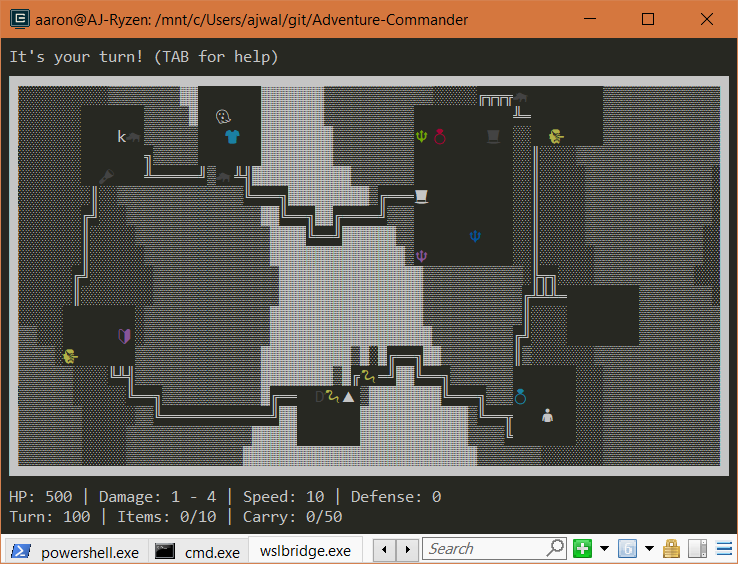
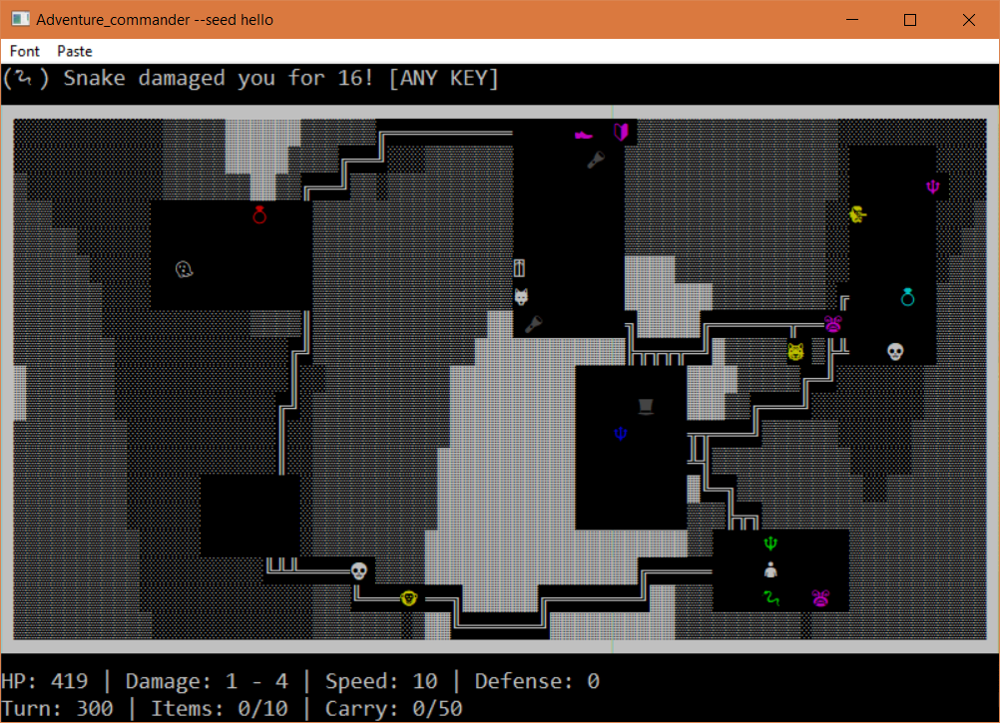
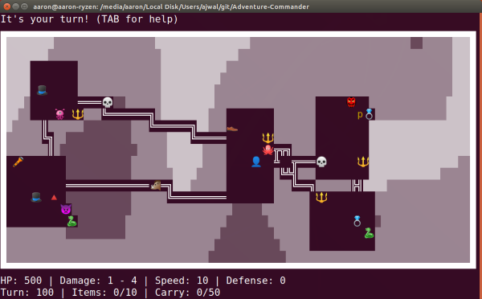
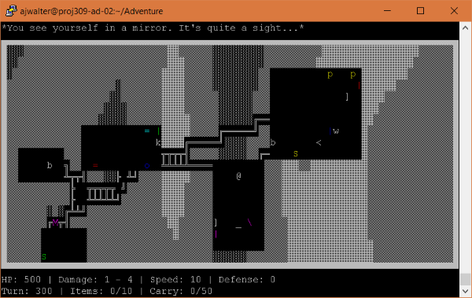
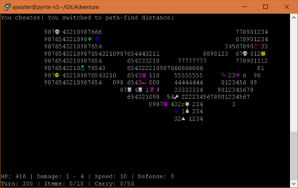

# Adventure Commander
A text base adventure game written in C++

## Author
Aaron Walter - ajwalter - 792829065

## Features
- Completely written in C++
- Cross platform with Linux and Windows (Portable)
- Uses UTF-8 characters with Emoji support that works cross platform
- No usages of `new` and `delete`, memory management with `std::shared_ptr<>`

## Final Assignment
For the final assignment, I decided to port my entire code base to Windows 
Visual C++ and MinGW build environments. I thought it would be a fun challenge 
to write 100% portable code (at least between the major desktop operating 
systems). 

The toughest challenge of porting the code was the preservation of UTF8 
(specifically emoji). Windows native consoles do not allow UTF8 beyond the 
"Basic Multilingual Plane", so emojis were unsupported. Instead, I ported 
the code base to use a library called "Public Domain Curses" on Windows 
and regular NCurses on other linux based operating systems. 

The solution was challenging. The version of PDCurses that I am using allows 
me to render text to a graphical environment instead of the built in console. 
This also makes it a stand alone application that makes it feel more "native"
to windows. The main problem, however, is that UTF8 still isn't supported! To
use Unicode, you must first convert UTF8 to UTF16 using the native windows 
library. There are still some issues with this method which cause graphical
glitches when rendering Unicode in the native windows console.

There were many other challenges along the way, such as getting my Makefile to
compile on Windows and MinGW as well as various CMake issues. At one point I 
tried using SDL2 with SDL TTF, which failed pretty badly. The result, however
was driver.cpp and driver.h, which allows anyone to implement their own 
rendering subsystem if they want to port the code elsewhere.

The rest of this README describes various processes on how to build Adventure 
Commander for different platforms, as well as various troubleshooting tips.

## Build using the Makefile
#### Ubuntu
1. Install ncurses on Ubuntu: `sudo apt install libncursesw5-dev`
2. Go to Makefile Common

#### Fedora
1. Install ncurses on Fedora: `sudo yum install ncurses-devel`
2. Go to Makefile Common

#### Windows (Native with MinGW)
1. Navigate to the included PDCurses wingui library `cd library/PDCurses/wingui`
2. Build the library with `make -f Makefile.mng pdcurses.a WIDE=Y UTF8=Y`
3. Navigate to the project directory `cd ../../../`
4. Go to Makefile Common

#### Makefile Common
1. Run `make` to compile everything
2. Run `./game` to launch the game
3. Press `TAB` for in game help!

## Build using CMake
#### Windows (Native with Visual Studio 2017)
1. Open the `x64 Native Tools Command Prompt for VS 2017`*
2. Navigate to the `library\PDCurses\wingui` folder.
3. Build the library with `nmake -f Makefile.vc WIDE=Y UTF8=Y`
4. Open up Visual Studio and choose `File > Open > Folder...`
5. Make the folder `cmake-build-windows-64` in the root of the project
6. Go to CMake Common

#### Windows/Linux (Linux Build with CLion WSL Toolchain)
1. Install ncurses on WSL: `sudo apt install libncursesw5-dev`
2. Open the project with File > Open...
3. Set up your toolchain (if needed): 
https://www.jetbrains.com/help/clion/how-to-use-wsl-development-environment-in-clion.html
4. Go to CMake Common

#### Windows (Native with CLion Visual Studio Toolchain)
1. Open the project with File > Open...
2. Follow the first 3 steps of Build using CMake > Visual Studio
3. Go to CMake Common

#### CMake Common
1. Press the build button
2. Navigate to the build directory `cmake-build-*`
3. Copy the `resource` folder into this folder
4. Run `./Adventure_Commander` if in CLion, or press Play in VStudio
5. Press `TAB` for in game help!

## Console setup
This game uses UTF-8 to make it look nice! Please read this if your terminal 
looks messed up (ex: question marks or blank output):

- If you are using `Native Windows Build`, PDCurses should take care of emoji.
- If you are using `WSL bash`, use the console emulator `Cmder` for emoji.
- If you are using `gnome-terminal` (called Terminal), UTF-8 works with emoji. 
- If you are using `xterm`, press CTRL + RIGHT CLICK and enable TrueType fonts.
  (Use the --lame switch to disable emoji)

In any case, your locale should be set to "en_US.UTF-8". You can check with the
command `locale`. SSH environments can sometimes break this, so you might need
to put these in your `~/.profile` if you are using SSH and see question marks:

- `export LC_ALL=en_US.UTF-8`
- `export LANG=en_US.UTF-8`

## Screenshots

